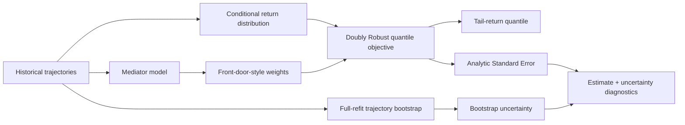
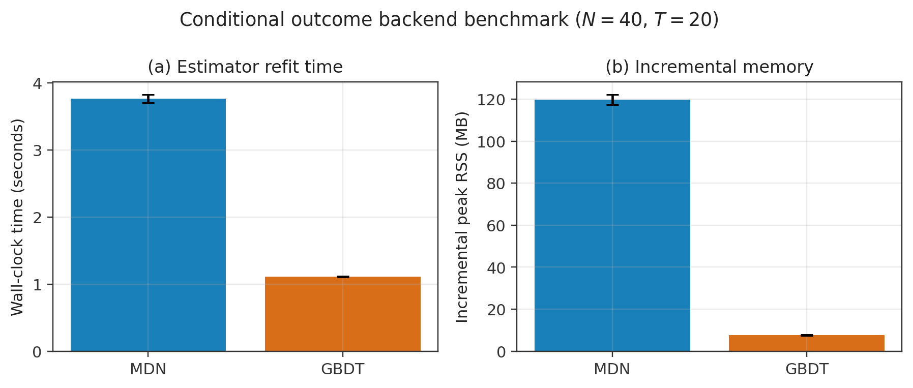
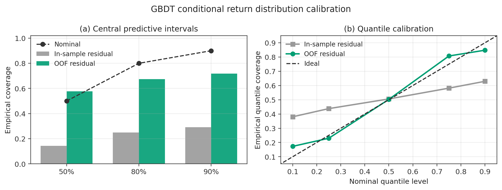
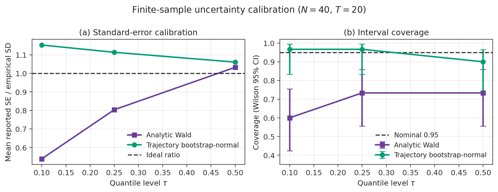
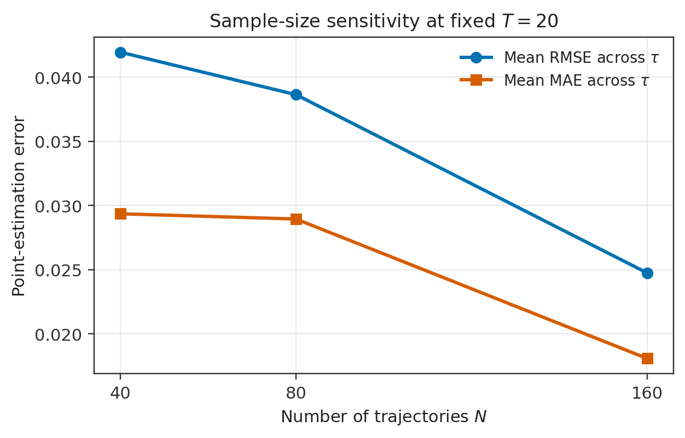
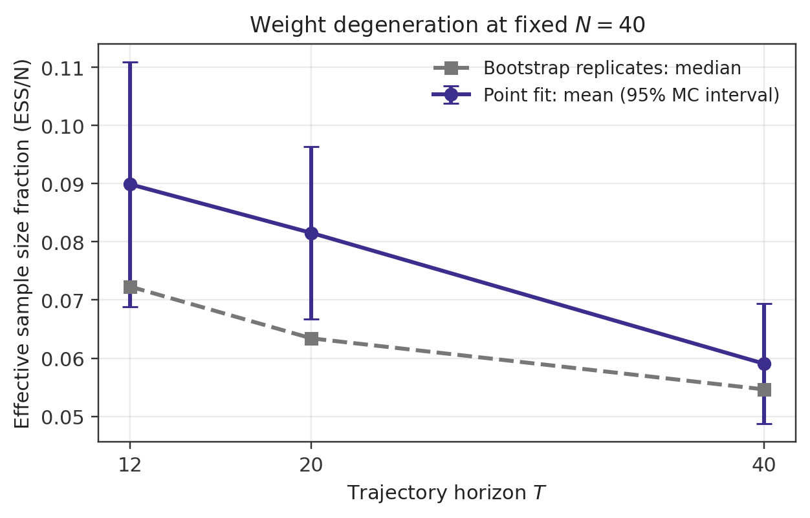

# Distributional Off-Policy Evaluation under Hidden Confounding

Finite-sample calibration and financial simulation for quantile policy evaluation.

## Project overview

Historical decisions are generated by a **behavior policy**, while the policy we
want to evaluate—the **target policy**—may make different choices. Off-Policy
Evaluation (OPE) asks what would have happened under the target policy without
deploying it. This is useful when direct experimentation is costly or risky.

This project studies Quantile Off-Policy Evaluation (QOPE). Three complications
motivate it. Historical actions are not random;
latent market conditions may affect both actions and later returns; and the mean
return hides downside risk. The target is therefore the quantiles of discounted
cumulative return under a target policy in sequential data with hidden
confounding. For example, `tau = 0.10` is the target policy's estimated 10%
lower-tail return level, not an expected return.

This is an implementation and finite-sample study, not a claim of a new
identification theorem. It integrates ideas from:

- [Xu et al. (2022), *Quantile Off-Policy Evaluation via Deep Conditional Generative Learning*](https://arxiv.org/abs/2212.14466), for doubly robust quantile estimation, conditional generative nuisance learning, Monte Carlo approximation, and sandwich-style inference.
- [Shi et al. (2022; Journal of the American Statistical Association 2024), *Off-Policy Confidence Interval Estimation with Confounded Markov Decision Process*](https://doi.org/10.1080/01621459.2022.2110878), for mediator-based identification in confounded sequential decision processes and uncertainty quantification.

The contribution here is **implementation + integration + finite-sample
diagnostics + calibration + financial simulation**.

## Methodology

A Confounded Markov Decision Process (CMDP) is a sequential decision system in
which an unobserved variable can affect both the action and later outcomes. The
synthetic trajectory follows the observed order

```text
state S_t -> action A_t -> mediator M_t -> reward R_t -> next state S_{t+1}
```

while a latent variable `U_t` also affects the behavior action, reward, and next
state. The target policy only receives observable state. The mediator supports a
front-door-style adjustment under the simulation's mediator assumptions.



Doubly Robust (DR) estimation combines a weighted observed-return term with an
outcome-model augmentation term. Cross-fitting keeps nuisance training rows
separate from evaluation trajectories. The pooled conditional outcome learner
has two interchangeable backends:

- Mixture Density Network (MDN): a flexible neural conditional generative reference.
- Gradient Boosting Decision Tree (GBDT): the primary two-stage location-scale learner. Its empirical standardized residual distribution is built from Out-of-Fold (OOF) location residuals, so it is a conditional return **distribution** learner rather than an ordinary point-prediction model.

The estimator retains the same weighting, DR objective, bounded quantile
optimization, Kernel Density Estimation (KDE) derivative term `j0`, and analytic
Confidence Interval (CI) calculation for both outcome backends. See
[docs/methodology.md](docs/methodology.md) for implementation details and the
important distinction from Shi et al.'s marginalized infinite-horizon estimator.

## Financial simulation

The Data-Generating Process (DGP) is a synthetic finite-horizon financial CMDP:

- **State:** recent return, volatility, momentum, liquidity, and drawdown.
- **Action:** flat or long.
- **Mediator:** realized exposure/execution, sampled after the action.
- **Reward:** exposed market return minus a turnover cost.
- **Latent confounder:** unobserved market pressure/regime information that affects the behavior action, reward, and transition.

`latent_u` is returned by the simulator only for simulation diagnostics. It is
never passed to the estimator. This is not a real-market backtest and makes no
claim of trading profitability.

## Core results

All displayed numbers are derived from the summary files in [`results/`](results/).
The published configuration uses the frozen OOF-GBDT backend, front-door-style
weights, and trajectory-level full-refit bootstrap unless stated otherwise.

### 1. MDN versus GBDT computation

In 10 paired refits at `N=40`, `T=20`, the current result file gives:

| Backend | Mean wall time | Incremental peak Resident Set Size (RSS) |
|---|---:|---:|
| MDN | 3.761 s | 119.8 MB |
| GBDT | 1.107 s | 7.7 MB |

This is a `3.40x` runtime speedup and a `93.6%` reduction in **incremental**
peak RSS relative to the common process baseline. It is not a claim that total
machine memory fell by 93.6%.

Conditional-on-dataset procedural variability was substantially larger for the
MDN implementation:

| `tau` | MDN algorithmic Standard Deviation (SD) | GBDT algorithmic SD |
|---:|---:|---:|
| 0.10 | 0.1325 | 0.01929 |
| 0.25 | 0.1194 | 0.01588 |
| 0.50 | 0.1144 | 0.01899 |



### 2. Why naive GBDT residual calibration failed

Good point-prediction Root Mean Squared Error (RMSE) did not imply a calibrated
conditional distribution. Replacing in-sample residuals with trajectory-grouped
OOF residuals restored much of the predictive spread while preserving mean
prediction accuracy:

| Diagnostic | In-sample residual | OOF residual |
|---|---:|---:|
| 50% predictive coverage | 0.144 | 0.578 |
| 80% predictive coverage | 0.249 | 0.675 |
| 90% predictive coverage | 0.292 | 0.719 |
| Predictive Standard Deviation (SD) | 0.00739 | 0.02957 |
| Predictive Interquartile Range (IQR) | 0.01027 | 0.04930 |
| Mean RMSE | 0.03169 | 0.03177 |
| Continuous Ranked Probability Score (CRPS) | 0.02052 | 0.01787 |

OOF quantile calibration was `0.173`, `0.230`, `0.503`, `0.807`, and `0.848`
at nominal levels `0.10`, `0.25`, `0.50`, `0.75`, and `0.90`. Central
quantiles calibrate reasonably; the tails remain imperfect. This is not a claim
of complete predictive calibration.



### 3. Analytic versus trajectory-bootstrap uncertainty

The Standard Error (SE) ratio is

```text
mean reported SE / empirical SD across independent outer datasets.
```

A ratio near one indicates scale calibration. With `N=40`, `T=20`, 30 outer
datasets and 100 bootstrap replicates per dataset:

| `tau` | Analytic SE ratio | Analytic coverage | Bootstrap SE ratio | Bootstrap-normal coverage | Coverage MCSE | Wilson 95% interval |
|---:|---:|---:|---:|---:|---:|---:|
| 0.10 | 0.539 | 0.600 | 1.153 | 0.967 | 0.033 | [0.833, 0.994] |
| 0.25 | 0.804 | 0.733 | 1.114 | 0.967 | 0.033 | [0.833, 0.994] |
| 0.50 | 1.032 | 0.733 | 1.061 | 0.900 | 0.055 | [0.744, 0.965] |

Here Monte Carlo Standard Error (MCSE) and Wilson intervals quantify uncertainty
from only 30 coverage trials. All three bootstrap-normal Wilson intervals are
compatible with nominal 95% coverage; this does not mean exact 95% coverage.
Bootstrap-percentile intervals remain in the result file as a robustness check,
but bootstrap-normal is the primary reported method.



### 4. Sample-size sensitivity

At fixed `T=20`, averaging error over the three quantile levels:

| Trajectories `N` | Mean RMSE | Mean Absolute Error (MAE) |
|---:|---:|---:|
| 40 | 0.0419 | 0.0294 |
| 80 | 0.0386 | 0.0289 |
| 160 | 0.0247 | 0.0181 |

From `N=40` to `N=160`, mean RMSE falls by about 41% and mean MAE by about
38%. Point-estimation error improves overall with increasing trajectory count;
the individual quantile results are not asserted to be monotone.



### 5. Horizon and effective sample size

Effective Sample Size (ESS) summarizes how many trajectories effectively
contribute after importance weighting. At fixed `N=40`:

| Horizon `T` | Point-fit mean ESS/N | Bootstrap median ESS/N |
|---:|---:|---:|
| 12 | 0.0899 | 0.0723 |
| 20 | 0.0815 | 0.0634 |
| 40 | 0.0590 | 0.0546 |

Point-fit mean ESS/N decreases by about 34% from `T=12` to `T=40`. Full-
trajectory importance weights are statistically motivated by sequential change
of measure, but suffer from finite-sample weight degeneration as the horizon
grows.



## Key takeaways

1. Distributional policy evaluation supplies lower-tail risk information that mean-return OPE cannot.
2. Outcome-model calibration matters: good RMSE does not guarantee a calibrated conditional return distribution.
3. Full-refit trajectory bootstrap substantially improves finite-sample uncertainty calibration relative to plug-in Wald intervals in the studied configuration.
4. Longer decision horizons increase importance-weight concentration and reduce effective sample size.

## Reproducibility

The research results were produced with Python 3.12.5. For the primary GBDT
pipeline:

```bash
python -m venv .venv
source .venv/bin/activate
pip install -r requirements.txt
```

For the MDN reference backend and paired benchmark:

```bash
pip install -r requirements-full.txt
```

Regenerate all figures without refitting any model:

```bash
python experiments/make_figures.py
```

Run the small default bootstrap demo (`outer_trials=3`, `B=20`):

```bash
python experiments/bootstrap_calibration.py \
  --n 40 \
  --horizon 20 \
  --outer-trials 3 \
  --bootstrap-replicates 20 \
  --outcome-backend gbdt
```

Run the paired outcome-backend benchmark or held-out predictive calibration
after installing the full requirements:

```bash
python experiments/backend_benchmark.py
python experiments/outcome_calibration.py
```

The full uncertainty study used `outer_trials=30` and `B=100`; those expensive
values are documented, not set as public defaults. See
[docs/reproducibility.md](docs/reproducibility.md) for smoke-test commands,
seeding, output schemas, and compute cautions.

## Repository structure

```text
qope-finance-cmdp/
├── README.md
├── LICENSE
├── requirements.txt
├── requirements-full.txt
├── .gitignore
├── src/                 # estimator, outcome learners, DGP, policies
├── experiments/         # benchmark, calibration, bootstrap, plotting
├── results/             # summary-level CSV files and release figures
└── docs/                # methodology, diagnostics, reproducibility
```

## Terminology

| Term | Meaning |
|---|---|
| Off-Policy Evaluation (OPE) | Evaluate a target policy using data generated by another behavior policy. |
| Quantile Off-Policy Evaluation (QOPE) | Estimate quantiles of the target-policy return distribution rather than only its mean. |
| Markov Decision Process (MDP) | A state-action-reward-next-state sequential decision process. |
| Confounded Markov Decision Process (CMDP) | An MDP in which an unobserved factor affects action and outcome dynamics. |
| Doubly Robust (DR) | Combines weighting and outcome-model components. |
| Direct Method (DM) | Policy evaluation based primarily on an outcome/value model. |
| Inverse Probability Weighting (IPW) | Reweight observations by inverse action probabilities. |
| Importance Sampling (IS) | Estimate a target distribution through likelihood or probability ratios. |
| Mixture Density Network (MDN) | A neural network representing a conditional outcome as a Gaussian mixture. |
| Gradient Boosting Decision Tree (GBDT) | An ensemble of sequentially fitted decision trees. |
| Out-of-Fold (OOF) | A prediction or residual is produced by a model that did not train on that sample. |
| Monte Carlo (MC) | Approximation through repeated random sampling. |
| Data-Generating Process (DGP) | The simulated mechanism producing trajectories. |
| Standard Error (SE) | Estimated sampling uncertainty of an estimator. |
| Confidence Interval (CI) | An interval procedure intended to cover the target at a stated repeated-sampling rate. |
| Root Mean Squared Error (RMSE) | Square root of mean squared estimation error. |
| Mean Absolute Error (MAE) | Mean absolute estimation error. |
| Continuous Ranked Probability Score (CRPS) | Proper score for a complete predictive distribution; lower is better. |
| Effective Sample Size (ESS) | Weight-concentration diagnostic expressed as the equivalent number of equally weighted observations. |
| Effective Sample Size Fraction (ESS/N) | ESS divided by the number of trajectories. |
| Kernel Density Estimation (KDE) | Nonparametric density estimation used here near the target quantile. |
| Cumulative Distribution Function (CDF) | Probability that a random variable is at or below a value. |
| Probability Density Function (PDF) | Local density of a continuous random variable. |
| Resident Set Size (RSS) | Physical memory resident for the process. |
| `tau` | Quantile level; `tau=0.10` denotes a lower-tail quantile. |
| `j0` | Estimated local density/derivative term in the analytic SE. |
| `score_sd` | Standard deviation of the estimating-equation score. |

## Limitations

- The environment is synthetic and does not establish real trading profitability.
- Results are finite-sample simulations over a limited set of `N` and `T` configurations.
- Front-door identification relies on mediator assumptions encoded in the DGP.
- Full-trajectory weights can degenerate at longer horizons.
- Lower-tail predictive calibration remains imperfect after OOF residual calibration.
- Full-refit trajectory bootstrap is computationally expensive.
- The finance estimator is finite horizon and must not be conflated with the marginalized infinite-horizon estimator in Shi et al.
- The experiments evaluate one binary-action simulation and should not be generalized to arbitrary markets or policy classes without further validation.

## References and attribution

- Yang Xu, Chengchun Shi, Shikai Luo, Lan Wang, and Rui Song (2022). [*Quantile Off-Policy Evaluation via Deep Conditional Generative Learning*](https://arxiv.org/abs/2212.14466). arXiv:2212.14466.
- Chengchun Shi, Jin Zhu, Ye Shen, Shikai Luo, Hongtu Zhu, and Rui Song (2022; journal issue 2024). [*Off-Policy Confidence Interval Estimation with Confounded Markov Decision Process*](https://doi.org/10.1080/01621459.2022.2110878). Journal of the American Statistical Association, 119(545), 273–284.

This repository implements and integrates ideas from published research; the
underlying theoretical results belong to the cited authors. No paper PDF or
copied proof is included.

## License

Project-authored code is released under the [MIT License](LICENSE). Review the
attribution and publication checklist before public release.
